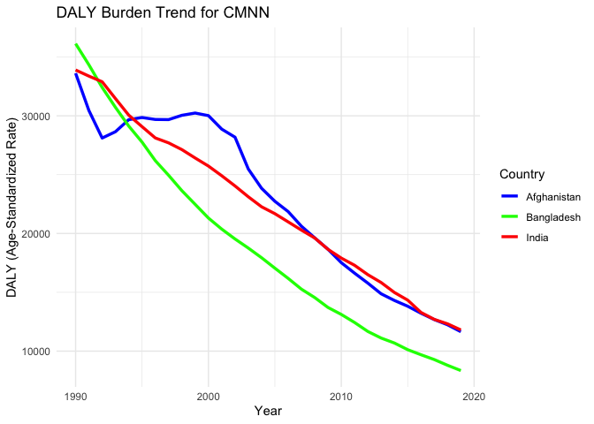

Global Disease Burden Analysis
================
Glenn De Lange

# Introduction

This document compares the Disability-Adjusted Life Year (DALY) diseases
burden for three countries: Afghanistan, Bangladesh, and India. We
compare the burden due to communicable, maternal, neonatal, and
nutritional diseases (CMNN).

The source data is from the Institute for Health Metrics and Evaluation
(IHME) Global Burden of Disease (GBD) study.

# Communicable, Maternal, Neonatal, and Nutritional Disease Burden (CMNN)

## Table of Estimates for CMNN Burden Over Time

| Year | Afghanistan | Bangladesh |    India |
|-----:|------------:|-----------:|---------:|
| 1990 |    33619.14 |  36134.375 | 33895.90 |
| 1991 |    30453.39 |  34335.227 | 33375.63 |
| 1992 |    28112.19 |  32408.578 | 32893.75 |
| 1993 |    28650.05 |  30720.194 | 31463.62 |
| 1994 |    29673.50 |  29129.271 | 30056.13 |
| 1995 |    29856.81 |  27768.443 | 29081.08 |
| 1996 |    29690.18 |  26188.310 | 28119.10 |
| 1997 |    29678.09 |  24946.518 | 27700.58 |
| 1998 |    30044.35 |  23636.124 | 27128.22 |
| 1999 |    30236.85 |  22474.377 | 26415.00 |
| 2000 |    30014.87 |  21310.944 | 25728.70 |
| 2001 |    28868.53 |  20370.604 | 24907.14 |
| 2002 |    28184.19 |  19533.705 | 24039.62 |
| 2003 |    25480.64 |  18759.738 | 23118.65 |
| 2004 |    23839.24 |  17937.137 | 22267.72 |
| 2005 |    22735.86 |  17051.212 | 21683.08 |
| 2006 |    21860.23 |  16182.814 | 20985.53 |
| 2007 |    20615.41 |  15266.509 | 20284.67 |
| 2008 |    19625.52 |  14552.408 | 19615.25 |
| 2009 |    18656.01 |  13710.257 | 18650.45 |
| 2010 |    17518.71 |  13118.278 | 17907.34 |
| 2011 |    16626.51 |  12433.945 | 17295.99 |
| 2012 |    15777.74 |  11670.197 | 16497.53 |
| 2013 |    14872.69 |  11110.703 | 15829.94 |
| 2014 |    14306.13 |  10688.077 | 14983.53 |
| 2015 |    13815.73 |  10122.364 | 14332.53 |
| 2016 |    13219.40 |   9692.399 | 13288.66 |
| 2017 |    12683.09 |   9282.361 | 12696.29 |
| 2018 |    12237.42 |   8795.442 | 12319.55 |
| 2019 |    11651.19 |   8347.075 | 11801.44 |

## Plot Showing Trends in CMNN Burden Over Time

<!-- -->

## Summary of CMNN Burden Findings

The table and chart show that the DALY burden due to communicable,
maternal, neonatal, and nutritional diseases has generally decreased
over time for Afghanistan, Bangladesh, and India. However, there are
variations in the trends among the countries, with Afghanistan showing a
more fluctuating pattern compared to Bangladesh and India. Overall, this
decrease indicates improvements in health outcomes related to these
diseases.
